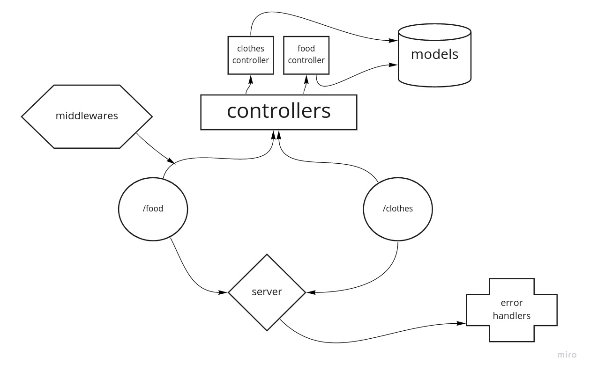

# basic-api-server

[AWS DEPLOY LINK](http://apiserver-env.eba-c4bv2n4j.us-east-1.elasticbeanstalk.com/)

[dev branch](https://github.com/ahmadammmoura/basic-api-server/tree/dev)

[action link](https://github.com/ahmadammmoura/basic-api-server/actions)

### UML

